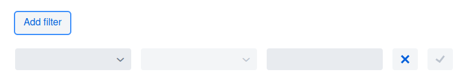

# vaadin-simple-grid-filter

A Vaadin Flow component for filtering Grids.

## Installation
[Installation guide for the latest release](https://github.com/xdev-software/vaadin-simple-grid-filter/releases/latest#Installation)

#### Compatibility with Vaadin

| Vaadin version | Grid-Filter version |
| --- | --- |
| Vaadin 24+ (latest) | ``1+`` |

## Run the Demo
* Checkout the repo
* Run ``mvn install && mvn -f vaadin-simple-grid-filter-demo spring-boot:run``
* Open http://localhost:8080

  
Show example

  
  

## Support
If you need support as soon as possible and you can't wait for any pull request, feel free to use [our support](https://xdev.software/en/services/support).

## Contributing
See the [contributing guide](./CONTRIBUTING.md) for detailed instructions on how to get started with our project.

## Dependencies and Licenses
View the [license of the current project](LICENSE) or the [summary including all dependencies](https://xdev-software.github.io/vaadin-simple-grid-filter/dependencies)
